# Utilisation du logiciel Mbed Studio

[TOC]

## Introduction

### Le logiciel Mbed Studio

**Mbed Studio** est un logiciel créé par ARM pour développer sous l'environnement recommandé en local sur son propre PC. Il s'agit d'un IDE basé sur **Visual Studio Code**, qui intègre un **terminal** qui se connecte automatiquement à la carte, un **débogueur** et une interface pour récupérer les **bibliothèques** disponibles sur le site de ARM.

### Comparaison avec l'IDE en ligne

Par rapport au compilateur Mbed en ligne (https://ide.mbed.com/compiler), il possède nombre d'**avantages**&nbsp;:

1. Il fonctionne sous **Windows, Mac et Linux** ;
2. Pas besoin d'installer **ni pilotes ni PuTTY** : il suffit de brancher la carte, cliquer sur le bouton Play et on voit le résultat directement dans l'IDE ;
3. On peut **déboguer** le programme : placer des breakpoints, voir la stack en cas de segfault / d'exception, etc. (cf plus bas) ;
4. Il possède une très bonne **complétion automatique** et **analyse statique** de votre code, ce qui vous évitera des erreurs basiques ;
5. Il possède un **thème sombre** et une **coloration syntaxique** très agréables.

En revanche, il possède quelques **inconvénients** :

1. Comme tout est installé sur votre PC, cela prend forcément **plus de place** que l'IDE en ligne (6-7Go au total) ;
2. Le logiciel est récent donc il y a **peu d'aide et de documentation** à son sujet (ce que ce guide essaie de compenser) ;
3. La **configuration** est parfois **peu intuitive** (mais vous n'aurez normalement pas besoin d'en faire beaucoup).

## Installation

### Téléchargement et connexion

Tout d'abord, **créez-vous un compte** sur le site de Mbed (https://os.mbed.com, coin en haut à droite).

Ensuite, rendez-vous sur https://os.mbed.com/studio et **téléchargez** la version qui correspond à votre OS. Une fois le téléchargement terminé, **installez** le logiciel (laissez bien coché la case pour l'installation des pilotes), **redémarrez** votre ordinateur (pour que les pilotes des cartes puissent prendre effet), puis **lancez Mbed Studio**.

À ce moment, une modale de connexion devrait s'afficher : **connectez-vous** avec votre compte Mbed.

### Présentation du logiciel

Une fois ceci fait, vous devriez voir apparaître la fenêtre suivante :

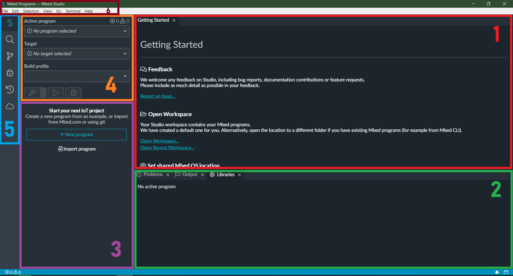

Voici l'explication des différentes zones :

1. **Vue principale :** C'est là que s'afficheront les fichiers source. Pour l'instant, la page d'accueil présente quelques informations utiles (qui seront redondées plus bas dans ce guide).
2. **Panneau inférieur :** Il contient les messages de compilation, les bibliothèques utilisées par le programme en cours, et le terminal.
3. **Workspace :** Ici s'affichera l'arborescence des fichiers de vos programmes. Mbed Studio vous a créé un workspace par défaut, c'est-à-dire le dossier dans lequel tous vos programmes seront placés. Sous Windows, celui-ci est dans `C:\Users\<votre nom>\Mbed Programs`. Vous pouvez changer ce dossier en cliquant sur *File / Open Workspace...*
4. **Configuration du projet :** Ici, vous choisirez le projet actif, la carte à laquelle le projet est dédié, et le profil de compilation (Debug / Develop / Release). En-dessous, trois boutons : Compiler, Lancer et Déboguer. Toutes ces fonctions seront présentées au fur et à mesure de ce guide.
5. **Barre latérale :** permet de changer le contenu de l'onglet à côté ; notamment, permet d'échanger entre la vue workspace (icône mbed, en cours) et la vue de débogage (icône en forme d'insecte).
6. **Barre supérieure** tout ce qu'il y a de plus classique. Certaines fonctionnalités seront explorées plus bas : elles seront indiquées en italique.

### Le terminal

Branchez maintenant la carte à votre PC. (Attention à bien utiliser le port nommé *USB STLink* sur la carte, c'est-à-dire celui des deux le plus proche du bord.) Vous devriez voir apparaître la fenêtre suivante :

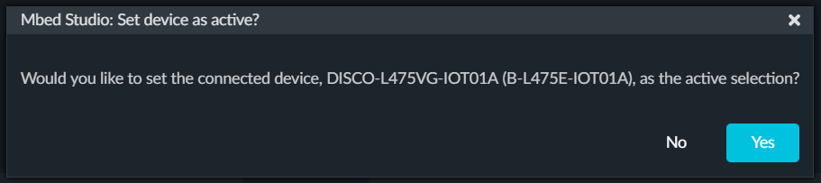

Cliquez sur "Yes". Dans le panneau inférieur, un nouvel onglet s'affiche : celui-ci contient le **terminal** lié à la carte. Si celle-ci contient déjà un programme, il y a de fortes chances que des messages s'affichent dans le terminal.

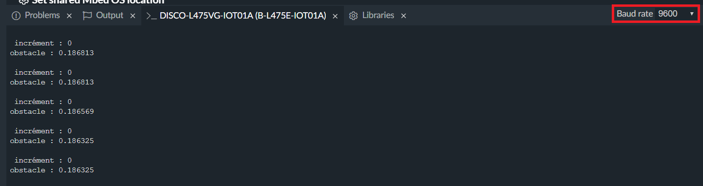

Si vous voyez une suite de caractères étranges, il s'agit peut-être d'un problème de **baud rate** (l'échantillonnage du signal série). Dans ce cas, changez la valeur du baud rate à l'aide du menu déroulant en haut à droite jusqu'à ce que le message s'affiche correctement. En général le baud rate vaut 9600, parfois 115200.

Si aucun message ne s'affiche, *pas de panique !* Vous pouvez aussi vérifier que Mbed Studio reconnaît la carte grâce à **l'icône USB verte** à côté du nom de votre carte dans la ligne "Target" de la zone de configuration du projet.

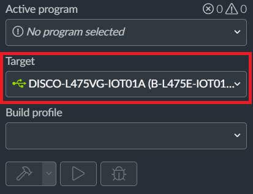

Si cette icône n'est pas présente, il y a probablement un problème de pilotes : essayez d'abord de redémarrer votre PC, puis si ça ne marche pas, vous pouvez tenter d'installer les pilotes à part : https://www.st.com/content/st_com/en/products/development-tools/software-development-tools/stm32-software-development-tools/stm32-utilities/stsw-link009.html (Windows seulement).

Enfin, si vous voulez gagner un peu de place à l'écran, vous pouvez **cacher le panneau inférieur** en cliquant sur *View / Toggle bottom panel* ou en appuyant sur <kbd>Ctrl</kbd> + <kbd>J</kbd>.

## Utilisation

### Créer un projet

#### À partir d'un exemple : Blinky

##### Import de l'exemple

Dans la barre supérieure, cliquez sur *File / New program...* La fenêtre suivante devrait s'afficher.

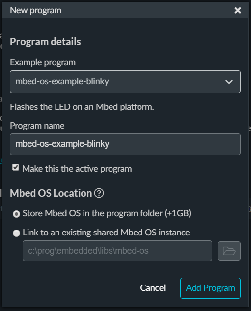

Dans le menu déroulant "Example program", sélectionnez *mbed-os-example-blinky* sous *Mbed OS 6*. Laissez les autres champs par défaut et cliquez sur "Add Program".

Mbed Studio va créer un nouveau programme dans votre workspace avec les fichiers exemples et y télécharger la bibliothèque Mbed OS. Quand il aura terminé (ce qui peut prendre quelques minutes), l'écran devrait ressembler à ce qui suit :

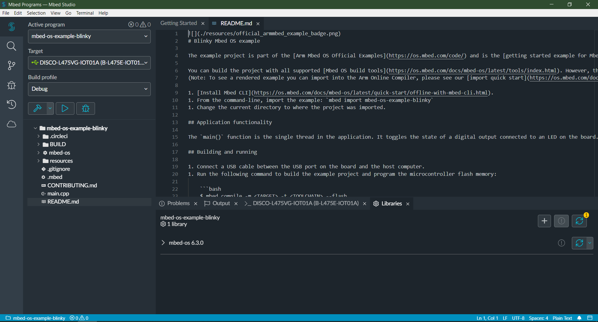

Le fichier `README.md` s'affiche. Les instructions contenues concernent les gens qui compilent le projet à la main, donc vous pouvez les ignorer. En revanche, le fichier `main.cpp` est plus intéressant : ouvrez-le en cliquant dessus depuis le workspace.

```c++
/* mbed Microcontroller Library
 * Copyright (c) 2019 ARM Limited
 * SPDX-License-Identifier: Apache-2.0
 */

#include "mbed.h"

// Blinking rate in milliseconds
#define BLINKING_RATE  500ms

int main()
{
    // Initialise the digital pin LED1 as an output
    DigitalOut led(LED1);

    while (true) {
        led = !led;
        ThisThread::sleep_for(BLINKING_RATE);
    }
}
```

Si ce n'est pas le même fichier qui s'affiche, vous avez peut-être créé un projet basé sur Mbed OS 5. Supprimez-le et recréez un nouveau projet en choisissant bien le projet d'exemple sous Mbed OS 6.

##### Explication du code

Analysons ce programme morceau par morceau.

###### Les commentaires

```c++
/* mbed Microcontroller Library
 * Copyright (c) 2019 ARM Limited
 * SPDX-License-Identifier: Apache-2.0
 */
```

Ceci est un **commentaire** en forme de bloc. Il commence par `/*` et termine par `*/`. Ici, chaque nouvelle ligne commence par une astérisque `*`, mais ce n'est nullement obligatoire.

Vous pouvez également voir un peu plus loin des lignes commençant par deux slashes `//` : ce sont également des commentaires, mais ceux-ci s'arrêtent à la fin de la ligne en cours.

###### Import de la bibliothèque Mbed OS

```c++
#include "mbed.h" 
```

Cette ligne permet d'utiliser la **bibliothèque Mbed OS**. N'oubliez pas de l'inclure en haut de chaque fichier !

###### Les *defines*

```c++
// Blinking rate in milliseconds
#define BLINKING_RATE  500ms
```

Cette ligne déclare un ***define*** : le mot `BLINKING_RATE` devient maintenant interchangeable avec la valeur associée, c'est-à-dire `500ms`. Un code plus moderne préfèrerait créer une vraie constante à la place, mais peu importe.

###### La fonction `main`

```c++
int main()
{
    ...
}
```

Ce morceau de code définit une **fonction** : la fonction `main`, qui ne prend aucun argument et renvoie un entier. Cette fonction est **spéciale** : le programme que la carte va effectuer commence au début de cette fonction et se termine à sa fin. Elle doit donc être toujours présente exactement **une fois par programme**, et toutes les fonctions que vous programmerez devront donc être appelées depuis ici, directement ou indirectement.

###### Déclaration d'une variable et les pins

```c++
// Initialise the digital pin LED1 as an output
DigitalOut led(LED1);
```

Ici, on **déclare une variable** nommée `led`, de type `DigitalOut`, et initialisée à `LED1`.

`DigitalOut` est un type de variable permettant d'**écrire des données binaires** (allumé / éteint) sur les pins et autres sorties de la carte. `LED1` est justement l'une de ces sorties : il s'agit de l'une des deux leds placées à côté de la prise *USB STLink*.

Sur le carton de la boîte de la carte, vous avez une **liste de tous les noms des pins externes**. Vous pouvez utiliser le nom en bleu ou celui en noir, au choix. Attention, parfois le nom dans le code n'est pas exactement le même que celui indiqué sur le carton, mais l'autocomplétion devrait vous mettre sur le droit chemin.

**D'autres types de variables sont disponibles :** `DigitalIn` permet de lire l'état binaire (allumé / éteint) d'une pin, `AnalogIn` permet de lire la tension (entre 0 et 5V) d'une pin, et `PwmOut` permet de faire de la modulation de puissance (via un duty cycle entre 0 et 1), pour par exemple régler la luminosité d'une led. **Attention cependant,** toutes les pins ne permettent pas de tout faire : `DigitalIn` / `DigitalOut` sont compatibles avec toutes les pins, mais `AnalogIn` seulement avec les pins A0 à A5 et D0/D1 et `PwmOut` avec les pins D3, D5, D6, D9, D10 et D11. Si vous essayez de lancer un programme avec une combinaison impossible, la carte affichera une erreur *pinmap not found for peripheral* dans le terminal. **Note :** `AnalogOut` ne semble **pas pris en charge** par cette carte.

###### La boucle principale

```c++
while (true) {
    ...
}
```

Puisque le programme se termine quand on sort du main, si on veut le faire tourner en permanence, il faut faire une **boucle infinie**. C'est précisément ce à quoi sert cette instruction : la condition est toujours vraie, donc on ne sort jamais de la boucle "tant que".

###### Faire clignoter la led

```c++
led = !led;
```

Cette instruction sert à **échanger la valeur de la led**. Elle est équivalente à la version suivante, un peu plus verbeuse mais aussi plus explicite : `led.write(1 - led.read())`.

```c++
ThisThread::sleep_for(BLINKING_RATE);
```

Pour éviter de faire clignoter la led à toute vitesse, on interrompt le programme à chaque itération. `BLINKING_RATE` a été défini au-dessus et vaut 500ms, donc la led changera d'état **toutes les demi-secondes**.

###### Remarques

Vous aurez remarqué que la fonction `main`, bien qu'indiquant retourner un entier, ne comporte pas d'instruction `return 0;`. En effet, cette fonction est la seule fonction où cette valeur de retour est implicite ; de plus, comme on a une boucle infinie, on ne devrait normalement jamais sortir de la fonction. Vous pouvez rajouter l'instruction à la fin si vous voulez, ça vous encouragera à y penser pour les autres fonctions que vous écrirez plus tard !

Voilà, c'est tout ! Si vous ne l'avez pas encore deviné, ces quelques lignes permettent de faire clignoter la led n°1 située à côté du port USB STLink. Voyons tout de suite si ce programme fonctionne !

##### Lancez le programme !

Dans la zone de configuration du projet, cliquez sur le bouton "Run program" indiqué ci-dessous.

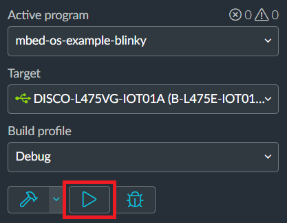

Cela devrait lancer la **compilation** dans l'onglet "Output" du panneau inférieur.

Si le bouton n'est pas disponible, assurez-vous que :

* La carte est bien branchée ;
* Le programme est bien actif. Si ce n'est pas le cas, faites un clic droit sur le dossier correspondant dans le workspace, puis *Set active program*.

La première compilation est **très longue**, car l'entièreté de la bibliothèque Mbed OS est compilée à ce moment-là. Ne vous inquiétez pas, pour les fois suivantes, seuls vos fichiers seront recompilés, cela ira donc **beaucoup plus vite**.

Une fois la compilation terminée (il ne devrait y avoir aucune erreur), une table résumant la taille de l'exécutable découpé par modules s'affiche, et Mbed Studio **transfère celui-ci sur la carte**.

Le **terminal** s'affiche alors. Comme le programme n'écrit aucun message dans le terminal, celui-ci devrait **rester vide**. Cependant, regardez la led n°1 : celle-ci **clignote !**

*Félicitations !* Vous avez lancé votre premier programme ! Vous avez beaucoup appris, donc prenez une bonne pause, vous l'avez bien méritée 😁

##### [Optionnel] Gérer les warnings

Dans le code d'exemple, vous pouvez voir des **warnings** : les vaguelettes jaunes en-dessous de certaines parties du code. Ceux-ci sont très importants pour vous prévenir où des bogues vont probablement survenir, et aussi pour améliorer votre style et vous faire découvrir le langage. Cependant, par défaut, beaucoup trop de warnings sont produits. Vous pouvez supprimer les plus ennuyants en allant dans *File / Settings / Open Preferences* (ou <kbd>Ctrl</kbd>+<kbd>,</kbd>), puis *User > Cpp*, puis *Clang-Tidy Checks* et en remplaçant la ligne par `*,-fuchsia*,-modernize-use-auto,-modernize-use-trailing-return-type,-hicpp-vararg,-cppcoreguidelines-pro-type-vararg`.

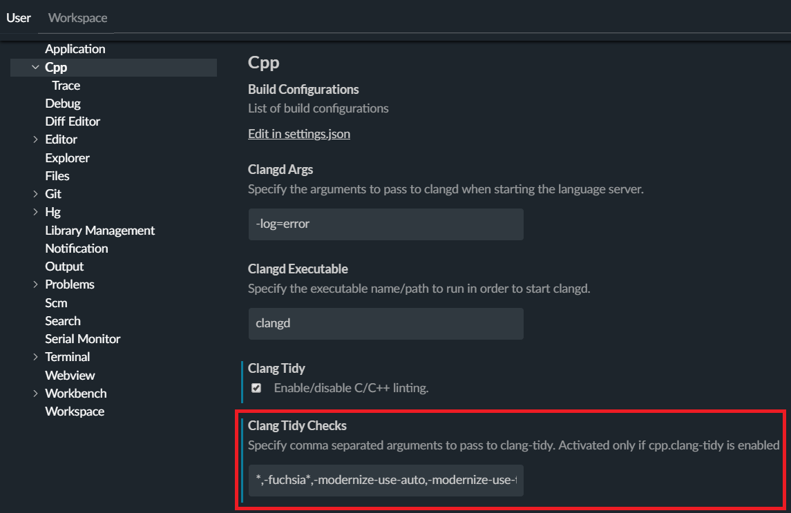

Malgré cette configuration, le warning à la ligne `led = !led;` devrait **encore être présent**. En effet, celui-ci utilise une **conversion implicite** entre entier et booléen, ce qui mène à de nombreux bogues difficiles à trouver en cas normal. Si vous voulez corriger ça, vous pouvez remplacer cette ligne par `led.write(1 - led.read());`.

#### [Optionnel] À partir d'un Mbed OS existant

**Mbed OS** est la bibliothèque principale des cartes ARM. Elle est aussi très lourde : **plus de 1Go !**

Par défaut, Mbed Studio va la **retélécharger entièrement** à chaque nouveau projet. Si vous ne voulez pas avoir plusieurs copies de Mbed OS sur votre PC, vous avez donc deux solutions :

1. Ne jamais créer plus d'un programme à la fois ;
2. **Mettre la bibliothèque en commun.**

Si vous lisez ces lignes, c'est que la deuxième solution vous intéresse. C'est par ici !

##### Depuis un projet existant

Partons du projet blinky créé ci-dessus. Comme dit plus haut, Mbed Studio a par défaut téléchargé l'entièreté de Mbed OS dans le dossier `mbed-os` du programme. Commencez déjà par **copier** ce dossier à l'endroit où vous voulez stocker la bibliothèque. **Attention**, si vous *coupez* le dossier, Mbed Studio ne reconnaîtra plus votre projet comme un projet Mbed et vous n'aurez plus qu'à en créer un autre.

Ensuite, dans le panneau inférieur, affichez l'onglet "Libraries". Ici, vous verrez une ligne indiquant "Mbed OS 6.3.0" (ou autre version). En passant la souris dessus, le bouton "Switch to shared" devrait apparaître : cliquez dessus.

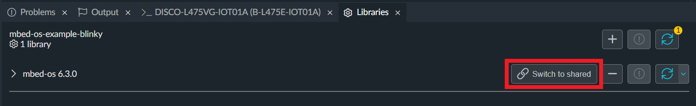

Dans la modale qui s'affiche, cliquez sur l'icône de dossier et sélectionnez le dossier mbed-os que vous venez de coller ailleurs.

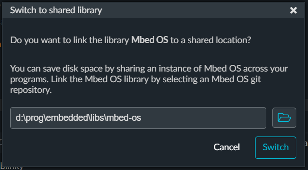

Note : si vous voulez changer de disque dans le menu de sélection de dossier, vous devez cliquer sur votre nom d'utilisateur en haut de la fenêtre.

Cliquez enfin sur "Switch" et le changement devrait se faire tout seul. Le dossier mbed-os d'origine dans le dossier du programme va être remplacé par un lien vers le dossier partagé.

##### Depuis Git

Si vous n'avez pas de projet créé par défaut ou si vous avez besoin d'installer une version spécifique de la bibliothèque, vous pouvez la télécharger directement depuis sa **page GitHub** : https://github.com/ARMmbed/mbed-os. **Deux méthodes** sont à votre disposition :

1. Si vous avez installé **git**, vous pouvez faire `git clone -b mbed-os-<votre version> --depth=1` depuis l'invite de commande dans le dossier de votre choix ;
2. Sinon, rendez-vous sur la page des tags : https://github.com/ARMmbed/mbed-os/tags. Sous la version dont vous avez besoin, cliquez sur l'icône **zip** (ou tar.gz), et décompressez l'archive ainsi téléchargée dans le dossier que vous voulez.

##### Créer un nouveau projet avec un Mbed OS partagé

Dans *File / New project...*, en bas de la fenêtre, cliquez sur le bouton "Link to an existing shared Mbed OS instance". Cliquez ensuite sur l'icône de dossier et sélectionnez le dossier où se trouve la bibliothèque.

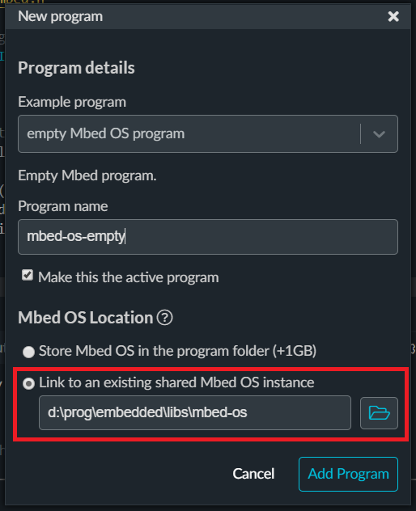

**C'est tout !** Mbed OS devrait s'occuper du reste.

**Note :** si vous voulez **modifier l'emplacement** de la bibliothèque dans le futur, vous devrez ou recréer vos projets ou passer temporairement sur une bibliothèque locale puis repasser sur la bibliothèque partagée. Il n'y a actuellement **aucun moyen connu** de corriger le chemin de la bibliothèque.

### Ajouter une bibliothèque

### Compiler et lancer le programme sur la carte

### Déboguer

## Exemples de projets

### Led contrôlée par un joystick

### Échange de données avec Thingspeak

## Problèmes connus

